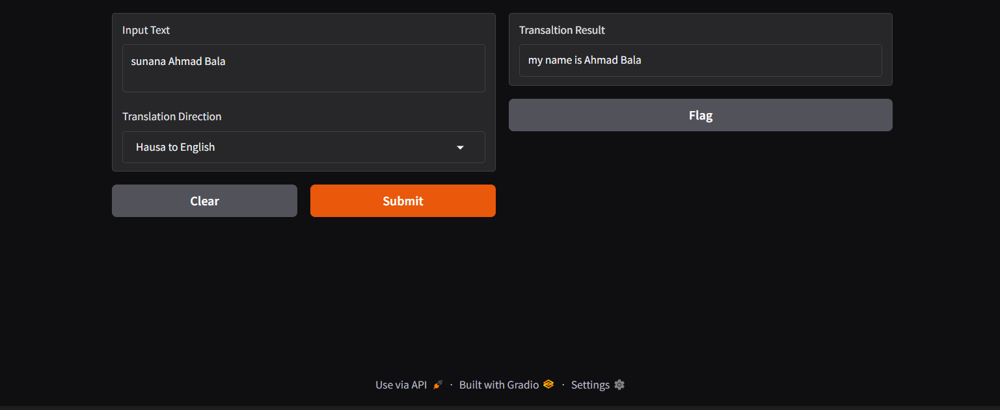

### **Gradio-Based Translation App (Work in Progress)**
This project is a simple language translation app built using **Gradio**. The application allows users to input text in one language and get its translation in another.

## **Current Features**
- **Text Input:** Users can enter text in the source language.
- **Translation Direction:** Dropdown menu to select translation direction (e.g., Hausa to English).
- **Translation Output:** Displays the translated result.
- **Interactive Buttons:** Includes **Submit, Clear, and Flag** buttons.
- **User-Friendly UI:** A clean and responsive UI built with Gradio.

## **Installation & Setup**
1. Clone this repository:
   ```sh
   git clone https://github.com/your-repo/gradio-translation-app.git
   cd gradio-translation-app
   ```
2. Install dependencies:
   ```sh
   pip install gradio transformers
   ```
3. Run the application:
   ```sh
   python app.py
   ```
4. Open the **Gradio** interface in your browser.

## **Planned Features**
- Support for more languages.
- Enhanced UI design.
- Integration with a custom translation model.
- User feedback mechanism.

## **Preview**


## **Contributing**
Contributions are welcome! Feel free to open issues or submit pull requests.

## **License**
MIT License
# Hausa-Text-to-English